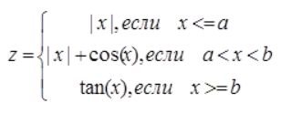
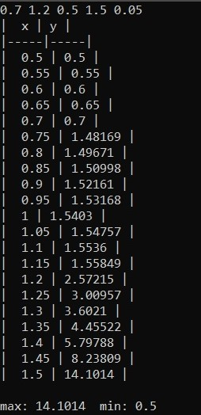
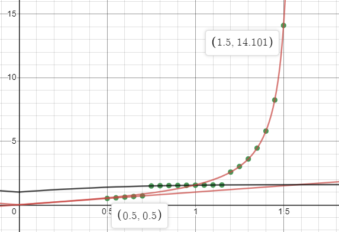

МИНИСТЕРСТВО НАУКИ  И ВЫСШЕГО ОБРАЗОВАНИЯ РОССИЙСКОЙ ФЕДЕРАЦИИ			

Федеральное государственное автономное образовательное учреждение высшего образования  

"КРЫМСКИЙ ФЕДЕРАЛЬНЫЙ УНИВЕРСИТЕТ им. В. И. ВЕРНАДСКОГО"  

ФИЗИКО-ТЕХНИЧЕСКИЙ ИНСТИТУТ  

Кафедра компьютерной инженерии и моделирования

<br><br/>

### Отчёт по лабораторной работе № 2 <br/> по дисциплине "Программирование"

<br/>
студента 1 курса группы ИВТ-б-о-192-(2)<br/>
Дубинина Дмитрия Александровича<br/>
направления подготовки 09.03.01 "Информатика и вычислительная техника"  
<br/>

<br/><br/>
<table>
<tr><td>Научный руководитель<br/> старший преподаватель кафедры<br/> компьютерной инженерии и моделирования</td>
<td>(оценка)</td>
<td>Чабанов В.В.</td>
</tr>
</table>
<br/><br/>


Симферополь, 2020

## Лабораторная работа №2 Табулирование кусочно-заданной функции
>Цель:

Овладеть практическими навыками разработки и программирования вычислительного процесса циклической структуры;
Сформировать навыков программирования алгоритмов разветвляющейся структуры;
Изучить операторы ветвления. Особенности использования полной и сокращенной формы оператора if и тернарного оператора.


>Ход работы

1. Написание кода.



Рис. 1 Используемая формула

Код программы:

```C++
#include <iostream>
#include <cmath>

using namespace std;

bool approximatelyEqualAbsRel(double a, double b, double absEpsilon, double relEpsilon)
{

	double diff = fabs(a - b);
	if (diff <= absEpsilon)
		return true;

	return diff <= ((fabs(a) < fabs(b) ? fabs(b) : fabs(a)) * relEpsilon);
}

int main() {

	double a, b, x1, x2, d, z, xma, xmi, x;

	bool flag = true;

	cin >> a >> b >> x1 >> x2 >> d;
	cout << "|  " << 'x' << " | " << 'y' << " |" << endl << "|-----|-----|" << endl;

	x = x1;
	xma = 0;
	xmi = 0;

	for (int i = 0; i <= (x2 - x1) / d; i++, x += d) {

		if (approximatelyEqualAbsRel(x, a, 1e-12, 1e-8)) z = abs(x);
		else if (x < a) z = abs(x);
		else if ((a < x) && (x < b)) z = abs(x)+cos(x);
		else if (approximatelyEqualAbsRel(x, b, 1e-12, 1e-8)) z = tan(x);
		else if (x > b) z = tan(x);

		if (flag) {
			xma = z;
			xmi = z;
			flag = false;
		}
		else if (z > xma) xma = z;
		else if (z < xmi) xmi = z;

		cout << "|  " << x << " | " << z << " |" << endl;
	}
	cout << endl << "max: " << xma << "  min: " << xmi << endl;

	return 0;
}
```

2. Результат работы программы



Рис. 2 Результат

3. Построение графика (точки max и min отмечены своими координатами)



Рис. 3 График

**Вывод**: в ходе лабораторной работы я овладел практическими навыками разработки и программирования вычислительного процесса; сформировал навык программирования алгоритмов разветвляющейся структуры; изучил операторы ветвления и особенности использования полной и сокращенной формы оператора if и тернарного оператора.
