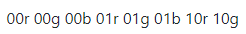
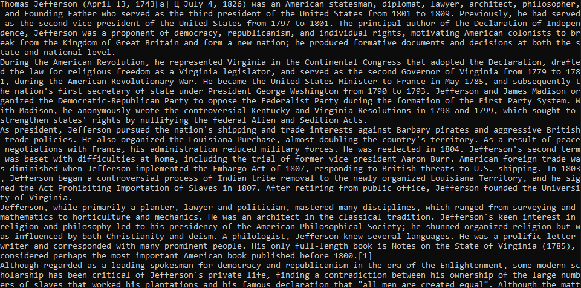

МИНИСТЕРСТВО НАУКИ  И ВЫСШЕГО ОБРАЗОВАНИЯ РОССИЙСКОЙ ФЕДЕРАЦИИ  
Федеральное государственное автономное образовательное учреждение высшего образования  
"КРЫМСКИЙ ФЕДЕРАЛЬНЫЙ УНИВЕРСИТЕТ им. В. И. ВЕРНАДСКОГО"  
ФИЗИКО-ТЕХНИЧЕСКИЙ ИНСТИТУТ  
Кафедра компьютерной инженерии и моделирования
<br/><br/>
### Отчёт по лабораторной работе № 3<br/> по дисциплине "Программирование"
<br/>
​
студента 1 курса группы ИВТ-б-о-192(2)  
<br/>Дубинина Дмитрия Александровича
<br/>направления подготовки 09.03.01 "Информатика и вычислительная техника" 

<br/><br/>
<table>
<tr><td>Научный руководитель<br/> старший преподаватель кафедры<br/> компьютерной инженерии и моделирования</td>
<td>(оценка)</td>
<td>Чабанов В.В.</td>
</tr>
</table>
<br/><br/>
​
Симферополь, 2020

#### Цель

* Закрепить навыки разработки программ использующих операторы цикла;
* Закрепить навыки разработки программ использующих массивы;
* Освоить методы подключения библиотек.

#### Ход работы

1. Исходное изображение (Рис.1.)

    <br/>
    Рис.1. Исходное изображение

2. Ключ (Рис.2.)

    <br/>
    Рис.2. Ключ
   
3. Код программы

    ```cpp
    #include <iostream>
    #include <ostream>
    #include <cmath>
    
    #include "libbmp.h"
    
    enum canal{
        RED,
        GREEN,
        BLUE
    };
    
    char to_char(bool arr [8]){
        int sum = 0;
        for (int i = 0; i < 8; i ++){
            sum += std::pow(2, i) * arr[i];
        }
        char res = sum;
        return res;
    }
    
    bool get_bit (int x, int y, BmpImg img){
        static int len = 0;
        int color_num;
        static canal color = RED;
        static bool temp [8] = {};
    
        switch (color){
            case RED:
                color_num = int(img.red_at(x,y))%2;
                break;
            case GREEN:
                color_num = int(img.green_at(x,y))%2;
                break;
            case BLUE:
                color_num = int(img.blue_at(x,y))%2;
                break;
        }
        temp[7 - len] = color_num;
        len ++;
    
        if (len == 8){
            char temp_char = to_char(temp);
            if (temp_char == char(0)){
                std::cout << std::endl;
                len = 0;
                color = static_cast<canal> ((color + 1)%3);
                return false;
            }else{
                std::cout << temp_char;
                len = 0;
                color = static_cast<canal> ((color + 1)%3);
                return true;
            }
        }
        color = static_cast<canal> ((color + 1)%3);
        return true;
    }
    
   int main() {
       BmpImg img; img.read ("pic3.bmp");
   
       const int x_max = 600, y_max = 650;
       for (int x_pos = 0; x_pos < x_max; x_pos ++){
           for (int y_pos = 0; y_pos < y_max; y_pos ++){
               if (!get_bit(x_pos, y_pos, img)) return 0;
               if (!get_bit(x_pos, y_pos, img)) return 0;
               if (!get_bit(x_pos, y_pos, img)) return 0;
           }
       }
       return 0;
   }
    ```
4. Декодированное сообщение (Рис.3.)

    <br/>
    Рис.3. Декодированное сообщение
   
#### Ввывод

в ходе лабораторной работы были получены такие навыки, как
* работать с изображениями формата BMP;
* писать сложные функции с использованием статических переменных и перечислений;
* умение создавать многофайловые проекты.

