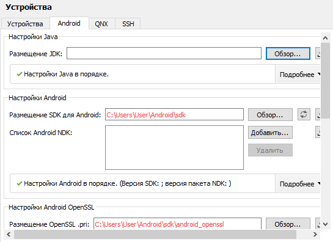
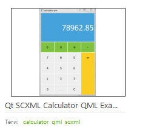

МИНИСТЕРСТВО НАУКИ  И ВЫСШЕГО ОБРАЗОВАНИЯ РОССИЙСКОЙ ФЕДЕРАЦИИ  
Федеральное государственное автономное образовательное учреждение высшего образования  
"КРЫМСКИЙ ФЕДЕРАЛЬНЫЙ УНИВЕРСИТЕТ им. В. И. ВЕРНАДСКОГО"  
ФИЗИКО-ТЕХНИЧЕСКИЙ ИНСТИТУТ  
Кафедра компьютерной инженерии и моделирования
  
### Отчёт по лабораторной работе № 8  по дисциплине "Программирование"
 
​
студента 1 курса группы ИВТ-б-о-192(2)  
 Дубинина Дмитрия Александровича
 направления подготовки 09.03.01 "Информатика и вычислительная техника" 

  
<table>
<tr><td>Научный руководитель  старший преподаватель кафедры  компьютерной инженерии и моделирования</td>
<td>(оценка)</td>
<td>Чабанов В.В.</td>
</tr>
</table>
  
​
Симферополь, 2020

#### Цель

* Настроить IDE Qt Creator для разработки приложений под android ОС;
* Изучить базовые понятия связанные с мобильной разработкой;
* Научиться создавать мобильные приложения при помощи фреймворка Qt 5.14.

#### Ход работы

1. Настраиваем Qt для разработки на андроид (рис. 1).

       
    Рис.1. Настроено правильно

2. Выбираем проект `Qt SCXML Calculator QML Example` для сборки (рис. 2).
    
       
    Рис.2. Qt SCXML Calculator QML Example
    
3. Собираем и запускаем проект.

       
    Рис. 3. Запущенное приложение
    

#### Ввывод

в ходе выполнения лабораторной работы были получены навыки
* создания приложений под Android ОС;
* умения собирать и запускать созданные приложения на устройствах под управлением Android ОС.
