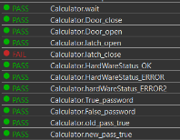
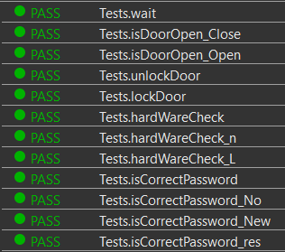

МИНИСТЕРСТВО НАУКИ  И ВЫСШЕГО ОБРАЗОВАНИЯ РОССИЙСКОЙ ФЕДЕРАЦИИ  
Федеральное государственное автономное образовательное учреждение высшего образования  
"КРЫМСКИЙ ФЕДЕРАЛЬНЫЙ УНИВЕРСИТЕТ им. В. И. ВЕРНАДСКОГО"  
ФИЗИКО-ТЕХНИЧЕСКИЙ ИНСТИТУТ  
Кафедра компьютерной инженерии и моделирования
<br/><br/>
### Отчёт по лабораторной работе № 9<br/> по дисциплине "Программирование"
<br/>
​
студента 1 курса группы ИВТ-б-о-192(2)  
<br/>Дубинина Дмитрия Александровича  
<br/>направления подготовки 09.03.01 "Информатика и вычислительная техника" 

<br/><br/>
<table>
<tr><td>Научный руководитель<br/> старший преподаватель кафедры<br/> компьютерной инженерии и моделирования</td>
<td>(оценка)</td>
<td>Чабанов В.В.</td>
</tr>
</table>
<br/><br/>
​
Симферополь, 2020

#### Цель

* Познакомиться с Google Test и Google Mock Framework;
* Изучить базовые понятия относящийся к тестированию кода;
* Научиться тестировать классы в среде разработки Qt Creator.

#### Ход работы

**1. Основной код:**
```C++
#ifndef TST_TESTDIVISIONBYZERO_H
#define TST_TESTDIVISIONBYZERO_H
#include <gtest/gtest.h>
#include <gmock/gmock.h>
#include <lockcontroller.h>
#include <ILatch.h>
#include <IKeypad.h>

using namespace testing;

class MockILatch: public ILatch{
public:
    MOCK_METHOD(bool, isActive, (), (override));
    MOCK_METHOD(DoorStatus, open,(),(override));
    MOCK_METHOD(DoorStatus, close,(), (override));
   MOCK_METHOD(DoorStatus, getDoorStatus,(),(override));
};

class MockIKeypad: public IKeypad{
public:
   MOCK_METHOD (bool, isActive,(),(override));
   MOCK_METHOD (void, wait,(),(override));
   MOCK_METHOD (PasswordResponse, requestPassword,(),(override));
};


//Тест 1
TEST(Calculator, wait)
{
        MockILatch latch;
        MockIKeypad keypad;
        LockController controller=LockController(&keypad, &latch);
        EXPECT_CALL(keypad, wait()).Times(1);
        controller.wait();
}

//Тест 2
TEST (Calculator, Door_close){
    MockILatch latch;
    MockIKeypad keypad;
    LockController controller=LockController(&keypad, &latch);
    EXPECT_CALL(latch,getDoorStatus()).Times(1);
    bool CheckDoor = controller.isDoorOpen();
    bool Check = CheckDoor;
    Check = false;
    EXPECT_FALSE(Check);
}

//Тест 3
TEST(Calculator, Door_open){
    MockILatch latch;
    MockIKeypad keypad;
    bool CheckDoor;
    LockController controller=LockController(&keypad, &latch);
    EXPECT_CALL(latch, getDoorStatus()).Times(1);
    CheckDoor = controller.isDoorOpen();
    EXPECT_TRUE(CheckDoor);
}

//Тест 4
TEST(Calculator, latch_open){
    MockILatch latch;
    MockIKeypad keypad;
    bool CheckDoor;
    LockController controller=LockController(&keypad, &latch);
    EXPECT_CALL(latch, getDoorStatus()).Times(1).WillOnce (Return(DoorStatus::OPEN));
    CheckDoor = controller.isDoorOpen();
    EXPECT_TRUE(CheckDoor);
}

//Тест 5
TEST(Calculator, latch_close){
    MockIKeypad keypad;
        MockILatch latch;
        LockController lc = LockController(&keypad, &latch);
        EXPECT_CALL(latch, close())//err.Times(1).WillOnce(Return(DoorStatus::CLOSE));
        EXPECT_EQ(lc.lockDoor(), DoorStatus::CLOSE);
}

//Тест 6
TEST(Calculator,HardWareStatus_OK){
    MockILatch latch;
    MockIKeypad keypad;
    LockController controller=LockController(&keypad, &latch);
    EXPECT_CALL(latch, isActive())//НУ СОЗДАНЫ ТИП))
           .Times(1)
      .WillOnce(Return(1));
    EXPECT_CALL(keypad, isActive())//НУ СОЗДАНЫ ТИП))
           .Times(1)
     .WillOnce(Return(1));
 HardWareStatus Status = controller.hardWareCheck();
    EXPECT_EQ(Status,HardWareStatus::OK);
}

//Тест 7
TEST(Calculator,HardWareStatus_ERROR){
     MockILatch latch;
     MockIKeypad keypad;
     LockController controller=LockController(nullptr, &latch);
     EXPECT_CALL(latch ,isActive()).Times(AtLeast(0)).WillOnce(Return(1));
     EXPECT_CALL(keypad, isActive()).Times(AtLeast(0)).WillOnce(Return(1));
     HardWareStatus Return=controller.hardWareCheck();
     EXPECT_EQ(Return,HardWareStatus::ERROR);
}

//Тест 8
TEST(Calculator,hardWareStatus_ERROR2){
    MockILatch latchTest;
       MockIKeypad keypadTest;
       LockController contrl=LockController(&keypadTest, &latchTest);
       EXPECT_CALL(latchTest, isActive())
               .Times(AtLeast(0))
         .WillOnce(Return(0));
       EXPECT_CALL(keypadTest, isActive())
             .Times(AtLeast(0))
        .WillOnce(Return(1));
       HardWareStatus Return=contrl.hardWareCheck();
           EXPECT_EQ(Return,HardWareStatus::ERROR);
}

//Тест 9
TEST(Calculator,True_password){
    MockILatch latch;
    MockIKeypad keypad;
    bool CheckPassword;
    //act
    LockController controller=LockController(&keypad, &latch);
    PasswordResponse response {PasswordResponse::Status::OK,"0000"};
    //assert
    EXPECT_CALL(keypad, requestPassword())
               .Times(1)
               .WillOnce(Return(response));
    CheckPassword = controller.isCorrectPassword();
    EXPECT_TRUE(CheckPassword);
}

//Тест 10
TEST(Calculator,False_password){
    MockILatch latch;
    MockIKeypad keypad;
    bool CheckPassword;
    //act
    LockController controller=LockController(&keypad, &latch);
    PasswordResponse response {PasswordResponse::Status::OK,"9999"};
    //assert
    EXPECT_CALL(keypad, requestPassword())
               .Times(1)
               .WillOnce(Return(response));
    CheckPassword = controller.isCorrectPassword();
    EXPECT_FALSE(CheckPassword);
}

//Тест 11
TEST(Calculator,old_pass_true){
    MockILatch latch;
        MockIKeypad keypad;
        bool CheckPassword;
        LockController controller=LockController(&keypad, &latch);

        PasswordResponse oldPass{PasswordResponse::Status::OK,"0000"};
     PasswordResponse newPass{PasswordResponse::Status::OK,"9876"};

        EXPECT_CALL(keypad, requestPassword())
                .Times(2)
                .WillOnce(Return(oldPass))
                .WillOnce(Return(newPass));
                controller.resetPassword();

         EXPECT_CALL(keypad, requestPassword()).Times(1).WillOnce(Return(newPass));

         CheckPassword = controller.isCorrectPassword();
          EXPECT_TRUE(CheckPassword);
}

//Тест 12
TEST(Calculator, new_pass_true){
    MockILatch latch;
    MockIKeypad keypad;
    LockController controller=LockController(&keypad, &latch);
    bool CheckPassword;
    PasswordResponse del_Pass{PasswordResponse::Status::OK,"0000"};
    PasswordResponse old_Pass{PasswordResponse::Status::OK,"9999"};
    PasswordResponse new_Pass{PasswordResponse::Status::OK,"9876"};
    EXPECT_CALL(keypad, requestPassword())
            .Times(2)
            .WillOnce(Return(del_Pass))
            .WillOnce(Return(old_Pass));
           controller.resetPassword();
     EXPECT_CALL(keypad, requestPassword()).Times(1).WillOnce(Return(old_Pass));
     CheckPassword = controller.isCorrectPassword();
      EXPECT_TRUE(CheckPassword);
      EXPECT_CALL(keypad, requestPassword()).Times(2).WillOnce(Return(old_Pass)).WillOnce(Return(new_Pass));
             controller.resetPassword();
       EXPECT_CALL(keypad, requestPassword()).Times(1).WillOnce(Return(new_Pass));
       CheckPassword = controller.isCorrectPassword();
        EXPECT_TRUE(CheckPassword);
}
#endif // TST_TESTDIVISIONBYZERO_H
```

**2. Во время тестирования выявлена ошибка (рис. 1)**

  <br/>
  Рис.1. Итог тестирования
  
**3. Исправление ошибки:**
  
  До:
  ```C++
DoorStatus LockController::lockDoor()
{
    return latch->open();
}
```

  После:
  ```C++
DoorStatus LockController::lockDoor()
{
    return latch->close();
}
```

**4. Тестирование исправленного кода (рис. 2)**

  <br/>
  Рис.2. Итог тестирования

Ссылка на файл с кодом: [Test.h](Test.h)

#### Ввывод

в ходе выполнения лабораторной работы были получены такие навыки
* умения работать с Google Test;
* умения создавать MOCK-Классы.
